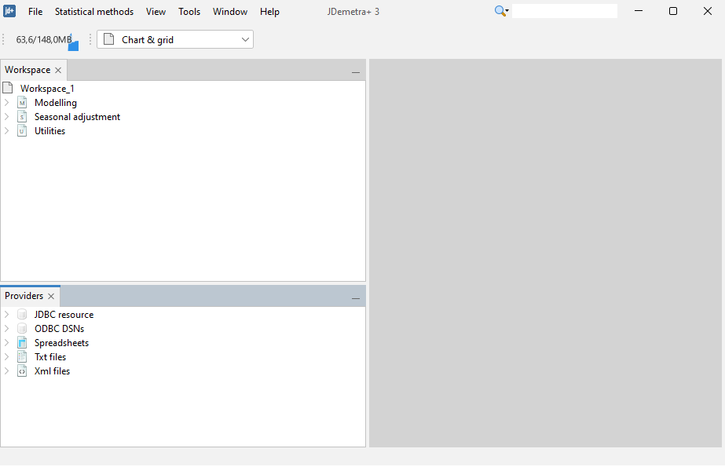
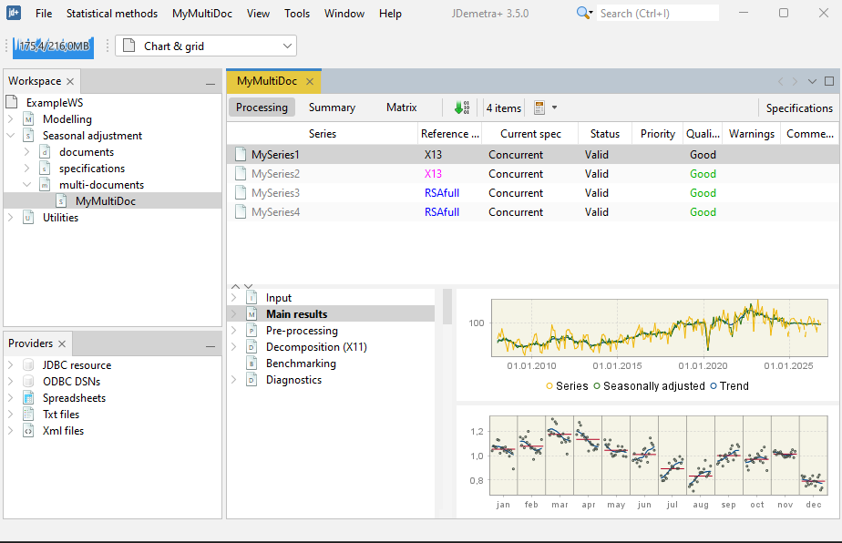
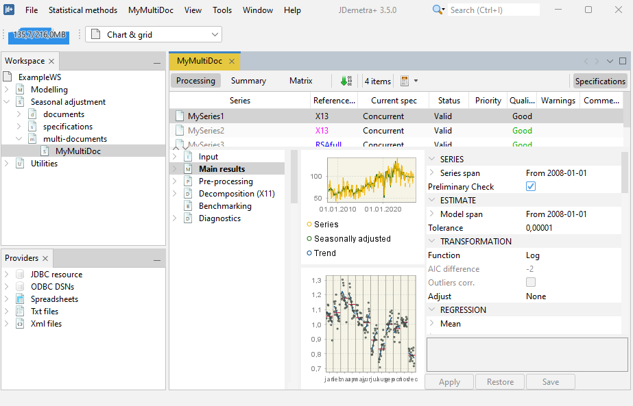

# JDemetra+-Quickstart for the graphical user interface (GUI) { .unnumbered #quickstart}

The sections below will briefly describe the steps involved in installing JDemetra+, uploading the data, perform seasonal adjustment and export the data. The guide is intended for a novice user, hence it does not dwell on the theoretical aspects of seasonal adjustment. 

-   How to install JDemetra+

-   How to get data into JDemetra+

-   How to do seasonally adjust your data

-   How to export the data

## JDemetra+ installation

Download from:

### The structure of the software
  
When JDemetra+ 3 starts, it opens with two main components: **Workspace** and **Providers**.  
  
- **Providers** are the mechanisms used to bring data into JDemetra+. They include several options, most importantly importing data from spreadsheets (see below), but also from databases and other external sources.  
- The **Workspace** is where all your work is organized and saved: seasonal adjustment specifications, input series, and results.  
  
  
  
---  
  
### The Workspace and seasonal adjustment  
  
The Workspace is structured into several sections. For seasonal adjustment, the most relevant part is:  
  
- **Seasonal adjustment → Multi-documents**  
  
A *multi-document* is a collection of seasonal adjustment items (often called **SA items**). Each SA item links:  
  
- one input time series,    
- one seasonal adjustment specification, and    
- the corresponding results (decomposition, diagnostics, seasonally adjusted series, etc.).  
  
This allows you to manage and process many series in a consistent way: for each series you can define, store, and reuse a specification, and then compute the seasonally adjusted results.  
  
  
  
---  
  
### Choosing the method and editing specifications  
  
Within a multi-document, each SA item can be configured individually.  
  
- By **right-clicking** on an SA item, you can choose the **base specification**, in particular whether the series should be adjusted using:  
  - **Tramo-Seats**, or    
  - **X-13-ARIMA** (X-13).  
  
- By **left-clicking** on an SA item, you open the detailed, method-specific **specification editor** (opens on the right side of the panel). Here you can set:  
  - the **ARIMA model** (automatic or user-defined),  
  - **outlier detection and treatment**,  
  - **calendar effects** (trading day, Easter, etc.),  
  - and the detailed options of the **seasonal adjustment** procedure itself (filters, decomposition options, diagnostics).  
  
These specifications can be saved and reused across series.  
  
  

DO WE WANT TO DISCUSS PLUG-INS HERE?

## Data import

From Excel

## Default seasonal adjustment

| Method      | Name in GUI   | Details                                                                                                                                              |
|-------------|---------------|------------------------------------------------------------------------------------------------------------------------------------------------------|
| Tramo-Seats | tramoseats    | Decomposition of the time series based on RegARIMA modelling                                                                                         |
| X-13-ARIMA  | x13           | Combination of RegARIMA modelling for calendar effect and moving average based decomposition (X-11) for the extraction of the seasonal effect        |

Full documentation of the Seats method can be found [here](https://jdemetra-new-documentation.netlify.app/m-x11-decomposition), while all details on X-11 can be found [here](https://jdemetra-new-documentation.netlify.app/m-x11-decomposition).

## Export the data

To export the data you can choose xlsx, csv

